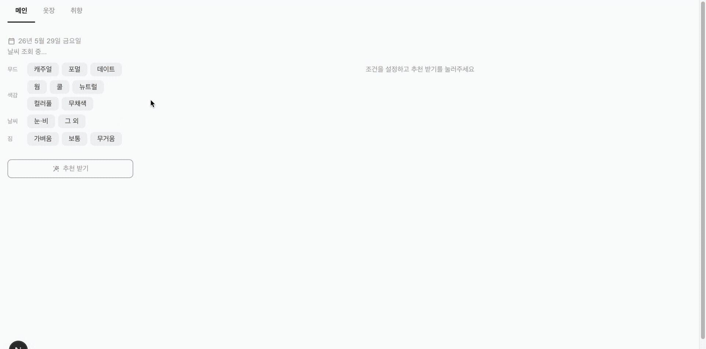

# OOTD 탐색 보조 대시보드

오늘 뭐 입을지 결정할 때 참고할 시각 자료를 한 화면에 모아주는 코디 탐색 보조 앱.
내 옷장과 취향 사진을 날씨·무드·색감 등 조건으로 필터링해 후보를 추려주는 구조입니다.

<br><br>

## 👩‍💻 개발 기간 및 정보

> 2026.05.16 - 2026.05.29 <br>1인 개발

<br><br>

## 💡 주요 기능

- 옷장: 코디 사진 등록 및 무드·색감·계절감·날씨·짐 태그 관리
- 취향: 참고할 룩 이미지 수집 및 태그 관리
- 메인: 날짜·날씨·조건 필터로 옷장·취향 사진 동시 필터링
- AI 학습: AI가 분석한 태그 수정 이력을 바탕으로 다음 분석 정확도 개선

<br><br>

## 🛠️ 기술 스택

| 분류     | 기술                             |
| -------- | -------------------------------- |
| Frontend | Next.js 16, React 19, TypeScript |
| 스타일링 | Tailwind CSS v4                  |
| AI       | Claude API (Anthropic)           |
| 날씨     | Open-Meteo API                   |
| 저장     | JSON 파일 (로컬)                 |

<br><br>

## 💻 화면 소개

|              각 탭               |
| :------------------------------: |
|  |

|           사진 업로드           |
| :-----------------------------: |
|  |

|               필터링               |
| :--------------------------------: |
|  |

<br><br>

## 📝 구현 상세

### 커스텀 Masonry 레이아웃

룩 사진은 잘리지 않고 원본 비율을 유지해야 했고, 동시에 여백 없이 빼곡하게 채워지는 레이아웃이 필요했습니다. CSS `columns`를 활용하면 세로 순서로 채워져 나중에 정렬 기준을 추가하기 어렵고 이미지 로드 전 높이 예측이 안 돼 JS로 직접 구현했습니다. 이미지 로드 시 실제 비율을 측정해 캐싱하고, ResizeObserver로 컨테이너 너비 변화를 감지할 때마다 각 아이템의 절대 좌표를 재계산합니다.

```ts
const layout = useCallback(() => {
  const cols = colCount(el.clientWidth - PAD * 2);
  const heights = Array<number>(cols).fill(0);
  const next = items.map((item) => {
    const col = heights.indexOf(Math.min(...heights));
    const h = colW * (ratios.current[item.id] ?? 1); // 비율 캐싱
    heights[col] += h + GAP;
    return { x, y, w: colW, h };
  });
}, [items]);
```

<br>

### 프롬프트 설계

Vision 태깅 프롬프트에서 각 태그의 기준을 구체적인 아이템과 실루엣 기준으로 정의했습니다. 예를 들어 seasonFeel은 "느낌"이 아닌 "옷의 실제 특징"으로 판단하도록 명시해 모호한 응답을 줄였고, SPRING/AUTUMN처럼 구분이 어려운 케이스는 둘 다 태그하도록 규칙을 추가했습니다.

AI 교정 프롬프트에는 기본 프롬프트와 기존 지침을 함께 전달해 새 지침이 기존 태그 정의를 위배하지 않도록 했습니다. 응답 형식도 `지침` 섹션만 파싱하는 구조로 제한해 불필요한 텍스트가 저장되지 않게 했습니다.

colorTone은 배열이 아닌 단일값으로 설계했습니다. 프롬프트로 "WARM과 COOL을 동시에 선택하지 마라" 같은 제약을 강제하는 방식을 먼저 시도했지만, LLM이 시각적 근거를 텍스트 제약보다 우선시해 신뢰성 있게 따르지 못했습니다. 후처리로 응답을 보정하는 방식 대신, 스키마 자체를 단일 선택으로 변경해 구조적으로 해결했습니다. 필터링 시에는 복수의 colorTone을 선택해 조회할 수 있어 사용성은 유지됩니다.

<br>

### 프롬프트 버전 관리 및 테스트 파이프라인

프롬프트를 `src/prompts/versions/` 하위에 버전 파일로 관리하고 `index.ts`에서 활성 버전을 지정합니다. calibration이 실행될 때마다 지침 스냅샷을 `src/data/analysis/versions/`에 저장하고 `CURRENT_VERSION`을 자동으로 올려 어떤 지침이 적용된 시점인지 추적할 수 있습니다.

`scripts/test-vision.ts`로 테스트 이미지에 대한 AI 분석 결과를 기대값과 비교하고, 버전별 결과를 `src/data/test/results/`에 저장합니다. calibration 전후 정확도를 버전 단위로 비교해 지침 개선 효과를 수치로 확인합니다.

```bash
npm run test:vision           # 버전별 정확도 측정
npm run test:vision:repeat    # 동일 이미지 반복 실행으로 재현성 확인
```

<br>

**버전별 개선 추이** (테스트 이미지 3장 기준)

| 단계 | 주요 변경                         | 통과 | 총 diff |
| ---- | --------------------------------- | :--: | :-----: |
| v1   | 베이스 프롬프트                   | 0/3  |    8    |
| v6   | calibration 적용                  | 0/3  |    6    |
| v13  | colorTone 단일 선택 + Sonnet 전환 | 1/3  |    5    |
| v14  | 기대값 보정                       | 1/3  |    4    |

<br>

**재현성 테스트** — `temperature: 0` 설정으로 동일 이미지 3회 반복 실행 시 3장 모두 100% 동일한 결과를 반환했습니다.

<br>

### AI 교정

태그를 수정할 때마다 원본·수정본 쌍을 corrections.json에 저장합니다. 수정이 5개 쌓일 때마다 자동으로 교정을 실행하며, 수동으로도 AI 학습 버튼으로 실행할 수 있습니다. 축적된 수정 이력을 Claude에 전달해 "어떤 사진에 어떤 태그를 달아야 하는지"에 대한 지침을 생성하고 calibration.txt에 저장합니다. 이후 분석 시 이 지침이 프롬프트에 포함되어 개인 취향에 맞게 태그 정확도가 개선됩니다.

프롬프트 응답은 `[분석]`과 `[지침]` 두 섹션으로 구성되며, calibration.txt에는 `[지침]`만 저장하고 전체 응답은 calibration_log.txt에 누적 기록합니다. 로그를 통해 AI가 어떤 이유로 교정 지침을 도출했는지 추적할 수 있습니다.

<br>

### Vision API 업로드 시 1회 실행

대시보드 렌더링·필터링 시에는 Claude API를 호출하지 않습니다. 사진 업로드 시점에만 한 번 실행하고 결과를 JSON에 저장해 API 비용과 응답 속도 문제를 해결했습니다. 이후 필터링은 저장된 태그 배열의 교집합으로만 처리합니다.

<br>

### EXIF 메타데이터 자동 활용

exifr로 업로드된 사진의 EXIF 데이터에서 촬영 날짜와 GPS 좌표를 추출합니다. 추출된 좌표와 날짜를 Open-Meteo Archive API에 전달해 당일 날씨(기온·날씨 조건)를 자동으로 채워줍니다. EXIF가 없거나 GPS 정보가 없는 경우엔 기본 위치(부산)를 사용합니다.

```ts
const exif = await extractExif(raw);
const lat = exif.lat ?? DEFAULT_LAT;
const lon = exif.lon ?? DEFAULT_LON;
const weather =
  exif.date !== null
    ? await fetchHistoricalWeather(lat, lon, exif.date)
    : defaultWeather;
```

<br>

### HEIC 지원

iOS에서 촬영한 HEIC/HEIF 파일을 heic-convert로 JPEG 변환 후 Claude API에 전달합니다. 변환은 서버에서만 처리하며 저장 파일도 JPEG로 유지합니다.
